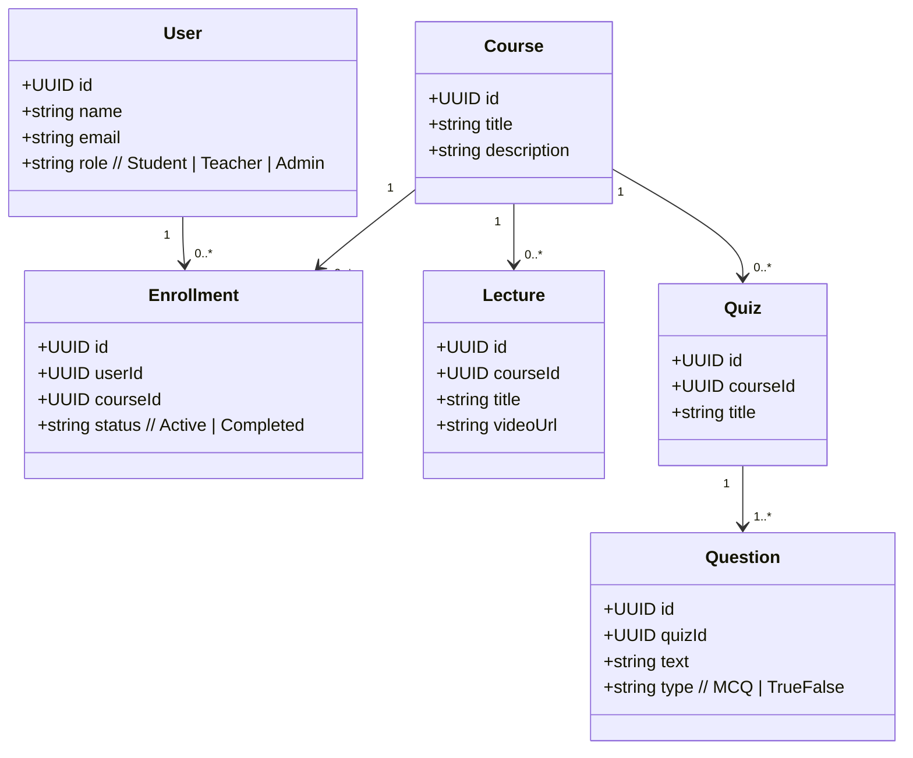
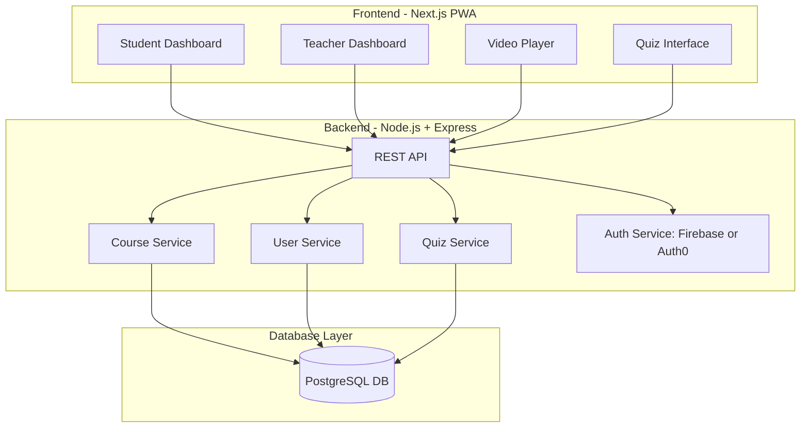

# Ta3allam Frontend

Welcome to the Ta3allam frontend project! This repository contains the source code for the user interface of Ta3allam, an educational platform designed to facilitate interactive learning experiences.

---

## Agile README Template

### 1. Project Overview
Brief summary of Ta3allam, its goals, and target users.

### 2. Technology Stack
Outline of main frameworks, libraries, and tools used.

### 3. Application Structure
High-level description of folder organization and key components.

### 4. Architecture
Summary of architectural patterns, state management, and data flow.

### 5. Development Workflow
Short explanation of agile practices, branching strategy, and CI/CD.

### 6. Feature List
Overview of planned features and user stories.

### 7. Contribution Guidelines
Summary of how to contribute, code standards, and review process.

### 8. Deployment
Brief notes on deployment strategy and environments.

---

Fill in each section as the project evolves to keep documentation up-to-date and useful for all contributors.